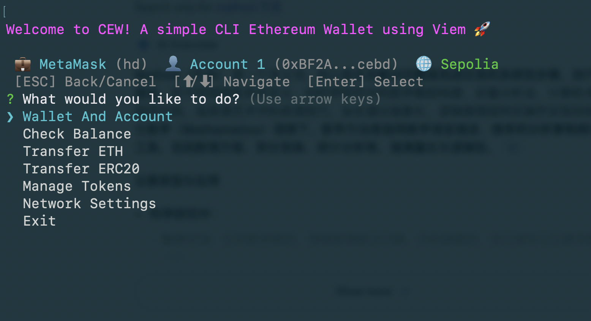

# CEW - A simple CLI Ethereum Wallet using Viem

A command-line interface wallet for the Sepolia Testnet, built with TypeScript and Viem.
It features secure encrypted storage for managing multiple wallets and accounts.



## Features
- 🔒 **Encrypted Storage**: Your keys are AES-256 encrypted using your password. No more plain text `.env` storage!
- 🔑 **Wallet Management**:
    - **HD Wallets**: Generate BIP-39 seed phrases and derived accounts.
    - **Import**: Import existing Seed Phrases, Private Keys, or Keystore Files.
    - **Switching**: Easily toggle between different wallets and accounts.
- 🌐 **Network Management**:
    - **Custom Networks**: Add any EVM-compatible chain (RPC, ChainID).
    - **Switching**: Toggle between Sepolia, Anvil, or your custom networks.
    - **Persistence**: Remembers your active network.
- 🪙 **Token Management**:
    - **Multi-Token Support**: Manage list of ERC20 tokens per network.
    - **Unified Balance**: See ETH and all tracked token balances in one view.
    - **Easy Transfers**: Select tokens directly from your list.
- 🗑️ **Deletion**: Safely remove unused wallets, accounts, or networks.
- 💰 **Assets**: Check ETH balances and transfer ERC-20 tokens.
- 💨 **EIP-1559**: Supports modern gas fee transactions.
- 🧰 **Standalone Executable**: Build a binary that runs without Node.js.

## Prerequisites
- Node.js (v18 or higher)
- npm or pnpm

## Installation

1. Navigate to the project directory:
   ```bash
   cd cew
   ```

2. Install dependencies:
   ```bash
   pnpm install
   ```

## Usage

### Interactive Mode (Recommended)
Simply run the start command to enter the interactive menu:
```bash
pnpm start
```
On first run, you will be prompted to **create a password** to secure your wallet storage.

**Main Menu Options:**
- **Wallet And Account**: Manage your identities.
    - *Generate New Wallet*: Create a new HD Wallet (batch generates first 10 accounts).
    - *Import*: Bring in existing keys/seeds.
    - *Switch*: Change active wallet/account.
    - *Delete*: Remove unwanted wallets or accounts.
    - *Export*: View seed phrases or private keys (requires password).
- **Check Balance**: View native ETH and managed Token balances.
- **Transfer ETH**: Send native currency.
- **Transfer ERC20**: Send tokens (select from managed list or enter custom address).
- **Manage Tokens**: Add/Remove tokens for the current network.
- **Network Settings**: Switch networks, add custom RPCs, or remove networks.

### Building Executable

You can compile the wallet into a single executable file (binary) for easy distribution or running on systems without Node.js.

1. Build the package:
   ```bash
   pnpm package
   ```

2. Run the executable:
   ```bash
   ./cew
   ```

## Architecture

- **`~/.cew/data/wallets.json`**: Stores your encrypted wallet data globally. **Do not delete this if you want to keep your accounts.**
- **Password**: The encryption key is derived from your password. **If you lose your password, you lose access to your local data.**

## Development

To compile the TypeScript code manually:
```bash
pnpm build
```
The output will be in the `dist` folder.
